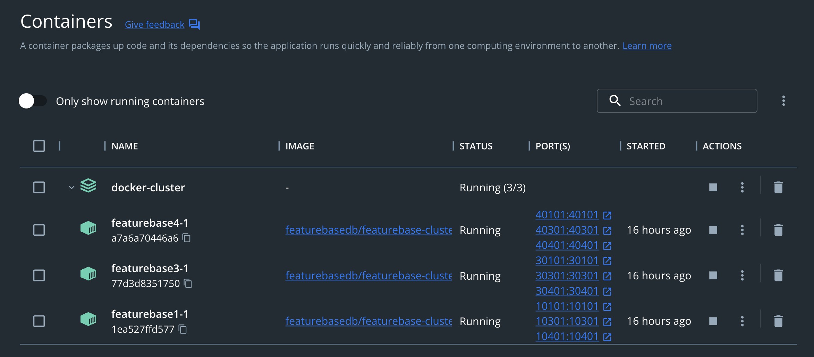
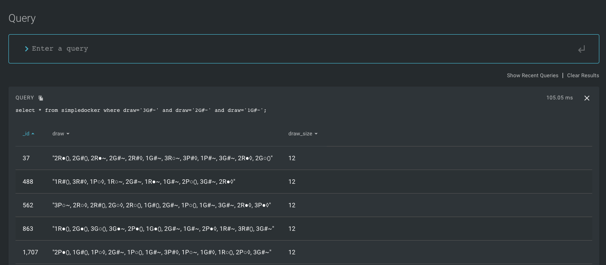

# FeatureBase Cluster with a Docker Deployment
This guide covers starting a small FeatureBase cluster using a simple Docker compose file and ingesting a moderate amount of data using a Python script. Three containers are started, each running an instance of FeatureBase. The solution exposes port `10101` for querying and ingestion.

A sample insert is done using `main.py` with Python.

If you would like to start an instance of FeatureBase configured for Kafaka ingestion, see the [Docker example](https://github.com/FeatureBaseDB/featurebase-examples/tree/main/docker-example) in this repo.

## Check Out the Repo
Clone the FeatureBase examples repo in a terminal and change into the `docker-cluster` directory:

```
git clone https://github.com/FeatureBaseDB/featurebase-examples.git
cd featurebase-examples/docker-cluster
```

## Start the Services
Start the services using `docker-compose`:

```
docker compose up -d
```

**NOTE**: If you have issues with `docker compose`, try disabling v2 by going into *settings..general* in Docker Desktop.

Once Docker builds the image, you should have three containers running:



## Run the Insert Script
The script inserts "draws" of 81 different cards from *Set the Game*. The cards are represented with strings. For example, `3G#~` is shorthand for 3 green shaded squiggles. 

Before you run the script, ensure you have the requirements installed:

```
pip3 install -r requirements.txt
```

Now run the script to insert data:

```
% python3 main.py
```

**OUTPUT**:

```
% python3 main.py
There are 1201000 existing records.
Enter the draw size (12,15,18,21,24...): 12
Enter the number of draws: 1000000
There are 1201000 total records..
There are 1301000 total records..
<a few seconds later>
There are 2101000 total records..
Generated a total of 1000000 draws.
```

**NOTE**:
When you use a FeatureBase cluster, you may need to determine which box is the `primary` node. To do this, see the `/status` endpoint:

```
curl http://localhost:10101/status
```

*OUTPUT**:
```
{"state":"NORMAL","nodes":[{"id":"284ec4e531a1059c","uri":{"scheme":"http","host":"172.25.0.4","port":30101},"grpc-uri":{"scheme":"grpc","host":"localhost","port":20101},"isPrimary":true,"state":"STARTED"},{"id":"68e557b92a56b2eb","uri":{"scheme":"http","host":"172.25.0.3","port":40101},"grpc-uri":{"scheme":"grpc","host":"localhost","port":20101},"isPrimary":false,"state":"STARTED"},{"id":"8630435ea9022f2b","uri":{"scheme":"http","host":"172.25.0.2","port":10101},"grpc-uri":{"scheme":"grpc","host":"localhost","port":20101},"isPrimary":false,"state":"STARTED"}],"localID":"8630435ea9022f2b","clusterName":"fb-cluster"}
```

## Use the UI to Query with SQL
To check this worked, in your browser head over to `http://0.0.0.0:10101` and run the following query:

```
select count(*) from dockercluster where draw='2R●⬯';
```



Try other queries to run:

```
select * from dockercluster where draw='1R●⬯' and draw='2R●⬯' and draw='3R●⬯';
```

or

```
select * from dockercluster where draw='2R●⬯' order by draw limit 10;
```


## Tear It Down
To remove the deployment run the following:

```
docker-compose down 
```

In the next guide we'll explore adding a few million draws of `Set the Game` into FeatureBase and reporting on the draws using graphs.

If you liked this guide, be sure to [join the Discord](https://discord.com/invite/bSBYjDbUUb) and give us a shout!


