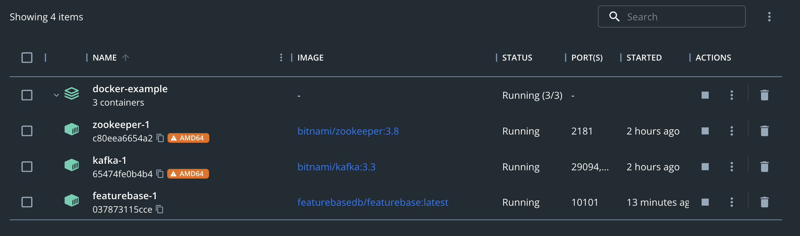
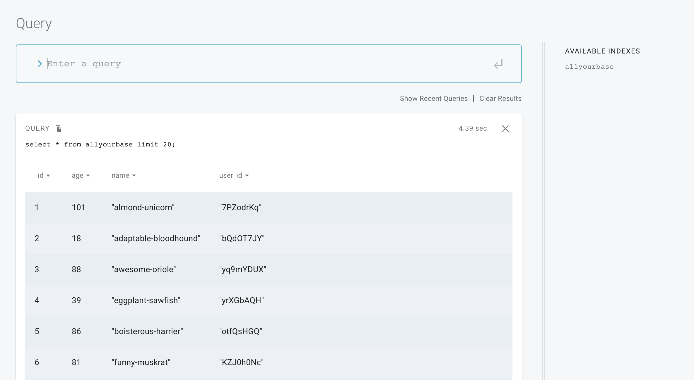

# Start FeatureBase with Docker
This guide covers starting FeatureBase using a Docker compose file. Kafka and Zookeeper are also run and a Python example file is provided to insert data into FeatureBase by sending the data to Kafka for ingestion.

If you want to run FeatureBase and Kafka from a terminal shell, you may [follow this guide](https://github.com/FeatureBaseDB/featurebase-examples/tree/main/kafka-starter).

## Check Out the Repo
Clone the FeatureBase examples repo in a terminal and change into the `docker-example` directory:

```
git clone https://github.com/FeatureBaseDB/featurebase-examples.git
cd featurebase-examples/docker-example
```

## Start the Services
Start the services using `docker-compose`:

```
docker-compose -f docker-compose.yml up -d
```

**NOTE**: If you have issues with `docker compose`, try disabling v2 by going into *settings..general* in Docker Desktop.

You should now have three containers running:



## Install the Python Requirements
Before we can run the Python example, we'll need to install the requirements for running the insert code. Start a new terminal and run the following:

```
pip3 install -r requirements.txt
```

You may need to update `pip`:

```
pip3 install pip --upgrade
```

## Run the Insert Script
The final step is to run the Python script to insert data into Kafka, which will then be read by the Kafka consumer and inserted into FeatureBase:

```
% python3 main.py
200000 records inserted.
```

**NOTE:**
If you have changed the schema in `schema.json`, you will need to rebuild the FeatureBase container.

```
./build.sh
```

Kill the container in the Docker UI and then run the compose file again to restart FeatureBase:

```
docker-compose -f docker-compose.yml up -d
```

## Use the UI to Query with SQL
To check this worked, in your browser head over to `http://0.0.0.0:10101` and run the following query:

```
select * from allyourbase limit 20;
```



## Tear It Down
To remove the deployment run the following:

```
docker-compose -f docker-compose.yml down 
```

In the next guide, we'll be exploring inserting a LOT more data and setting up Python queries for doing some simple reporting and graphing, using a simple Flask server driving a UI.

If you liked this guide, be sure to [join the Discord](https://discord.com/invite/bSBYjDbUUb) and give us a shout!


