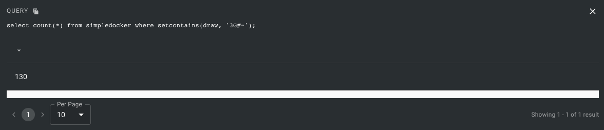

# FeatureBase with a Simple Docker Deployment
This guide covers starting FeatureBase using a simple Docker compose file and ingesting a moderate amount of data using a Python script. A container is started running a standalone instance of FeatureBase and exposes port `10101` for querying and ingestion.

Ingestion is done using Python through the `main.py` file.

If you want to ingest data with a CSV consumer, see the [docker-consumer](https://github.com/FeatureBaseDB/featurebase-examples/tree/main/docker-consumer) example in this repo. There's also an example of running a consumer on the host at the bottom of this guide.


If you would like to start an instance of FeatureBase configured for Kafaka ingestion, see the [docker-example](https://github.com/FeatureBaseDB/featurebase-examples/tree/main/docker-example) in this repo.

## Check Out the Repo
Clone the FeatureBase examples repo in a terminal and change into the `docker-simple` directory:

```
git clone https://github.com/FeatureBaseDB/featurebase-examples.git
cd featurebase-examples/docker-simple
```

## Create the Docker Network
Before starting the FeatureBase container(s), you will need to create a Docker network to be used by the services:

```
docker network create fbnet
```

If you want to use the default `bridge` network, delete the network section from `docker-compose.yml`:

```
networks:
  default:
    name: fbnet
    external: true
```

## Start the Services
Start the services using `docker-compose`:

```
docker compose up
```

**NOTE**: If you have issues with `docker compose`, try disabling v2 by going into *settings..general* in Docker Desktop.

You should now have a container running:


## Run the Insert Script
The script inserts "draws" of 81 different cards from *Set the Game*. The cards are represented with strings. For example, `3P○◊` is shorthand for 3 purple open diamonds. 

Before you run the script, ensure you have the requirements installed:

```
pip3 install -r requirements.txt
```

Now run the script to insert data:

```
% python3 main.py
```

**OUTPUT**:

```
% python3 main.py
There are 1201000 existing records.
Enter the draw size (12,15,18,21,24...): 12
Enter the number of draws: 1000000
There are 1201000 total records..
There are 1301000 total records..
<a few seconds later>
There are 2101000 total records..
Generated a total of 1000000 draws.
```

## Use the UI to Query with SQL
To check this worked, in your browser head over to `http://0.0.0.0:10101` and run the following query:

```
select count(*) from simpledocker where setcontains(draw, '3G#~');
```



Try other queries to run:

```
select * from simpledocker where setcontains(draw, '3G#~') and setcontains(draw, '2G○~');
```


## Alternate Ingestion Method
To insert data using a consumer on your local machine, you will need to follow the [Community Guide](https://docs.featurebase.com/community/community-setup/community-install-config) to unzip FeatureBase locally. This download will include the `molecula-consumer-csv` binary, which you can use to insert data into this example's FeatureBase.

When you run FeatureBase in a container, you'll have to tell your local machine to map the `featurebase` hostname in the local host's `/etc/hosts` file. Make the following entry in `hosts`


```
featurebase    127.0.0.1
```

Assuming you installed FeatureBase in the `~/featurebase/` directory, you can now run the IDK consumer directly:

```
~/featurebase/idk/molecula-consumer-csv \
--auto-generate \
--index=allyourbase \
--files=sample.csv
```

**OUTPUT**:
```
kord@bob featurebase $ idk/molecula-consumer-csv \
--auto-generate \
--index=allyourbase \
--files=sample.csv
Molecula Consumer v3.26.0-9-g14f19300, build time 2022-12-12T20:44:21+0000
2022-12-13T14:21:33.516988Z INFO:  Serving Prometheus metrics with namespace "ingester_csv" at localhost:9093/metrics
2022-12-13T14:21:33.519780Z INFO:  start ingester 0
2022-12-13T14:21:33.520360Z INFO:  processFile: sample.csv
2022-12-13T14:21:33.520437Z INFO:  new schema: []idk.Field{idk.StringField{NameVal:"asset_tag", DestNameVal:"asset_tag", Mutex:false, Quantum:"", TTL:"", CacheConfig:(*idk.CacheConfig)(nil)}, idk.RecordTimeField{NameVal:"fan_time", DestNameVal:"fan_time", Layout:"2006-01-02", Epoch:time.Date(1, time.January, 1, 0, 0, 0, 0, time.UTC), Unit:""}, idk.StringField{NameVal:"fan_val", DestNameVal:"fan_val", Mutex:false, Quantum:"YMD", TTL:"", CacheConfig:(*idk.CacheConfig)(nil)}}
2022-12-13T14:21:33.530045Z INFO:  Listening for /debug/pprof/ and /debug/fgprof on 'localhost:6062'
2022-12-13T14:21:33.564520Z INFO:  translating batch of 1 took: 42.707875ms
2022-12-13T14:21:33.564819Z INFO:  making fragments for batch of 1 took 303.708µs
<snip>
2022-12-13T14:21:33.975317Z INFO:  importing fragments took 305.542µs
2022-12-13T14:21:33.975485Z INFO:  records processed 0-> (10)
2022-12-13T14:21:33.975493Z INFO:  metrics: import=454.011583ms
```

## Tear It Down
To remove the deployment run the following:

```
docker-compose down 
```

In the [next guide](https://github.com/FeatureBaseDB/featurebase-examples/tree/main/bigdata-set) we'll explore adding a few million draws of `Set the Game` into FeatureBase and reporting on the draws using graphs.

If you liked this guide, be sure to [join the Discord](https://discord.com/invite/bSBYjDbUUb) and give us a shout!


