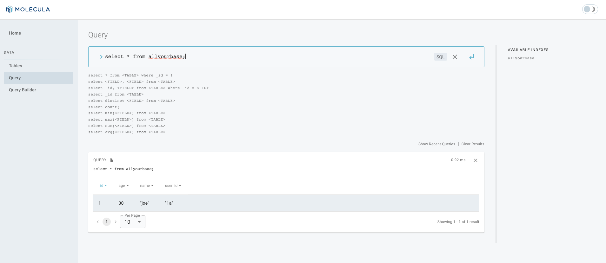

# FeatureBase + Kafka Starter
This example will guide you through getting Kafka set up for ingestion of JSON data into FeatureBase using Python. We'll use a simple schema for this example which uses `user_id`, `name` and `age`:

```
[
    {
        "name": "user_id",
        "path": ["user_id"],
        "type": "string"
    },
    {
        "name": "name",
        "path": ["name"],
        "type": "string"
    },
    {
        "name": "age",
        "path": ["age"],
        "type": "id"
    }
]
```

The process for getting this example going consists of:
1. [Install and start Featurebase](https://github.com/FeatureBaseDB/featurebase-examples/tree/main/kafka-starter#install-and-start-featurebase)
1. [Install and start Kafka](https://github.com/FeatureBaseDB/featurebase-examples/tree/main/kafka-starter#install-and-start-kafka)
1. [Start the Kafka consumer](https://github.com/FeatureBaseDB/featurebase-examples/tree/main/kafka-starter#start-the-ingestor)
1. [Install the Python dependencies](https://github.com/FeatureBaseDB/featurebase-examples/tree/main/kafka-starter#install-the-requirements)
1. [Insert sample data using Python](https://github.com/FeatureBaseDB/featurebase-examples/tree/main/kafka-starter#run-the-script)

## Clone the Repo
Start a terminal shell and then clone this repo locally (we'll use a `binary` directory on macOS in this example):

```
mkdir binary
cd binary
git clone https://github.com/FeatureBaseDB/featurebase-examples.git
```

Check the directory structure:

```
kord@bob binary % ls -lah
drwxr-xr-x    9 kord  staff   288B Oct 27 16:59 featurebase-examples
```

## Install and Start FeatureBase
We'll use a shortened version of the [welcome guide](https://docs.featurebase.com/) for running FeatureBase.

In your browser, head over to the [downloads](https://github.com/FeatureBaseDB/FeatureBase/releases) on the [Github repo](https://github.com/FeatureBaseDB/featurebase) and select the builds needed for your particular architecture. The ARM versions are for newer Macs or devices like the Raspberry Pi. The AMD versions are for Intel architectures.

Back in the terminal, you'll move the tarballs into the current directory:

```
mv ~/Downloads/featurebase-*.tar.gz ./
```

Check the directory again:

```
kord@bob binary % ls
featurebase-examples
featurebase-v1.2.0-community-darwin-arm64.tar.gz
```

Now use `tar` to un-compress the files:

```
tar xvfz featurebase-*.tar.gz
```

Let's move the directories into something that's a little easier to type:

```
mv featurebase-*-arm64/ opt
mv idk-*-arm64 idk
```

Now remove the offending tarballs (optional AND BE CAREFUL WITH THIS):

```
rm *.gz*
```

Here's how all this should look in the `binary` directory now:

```
kord@bob binary % ls -lah
drwxr-xr-x    9 kord  staff   288B Oct 27 16:59 featurebase-examples
drwxr-xr-x@   7 kord  staff   224B Oct 28 13:17 idk
drwxr-xr-x@   7 kord  staff   224B Oct 28 13:21 opt

```

### Set File Flags to Run
Before you start the server, you may need to turn off the quarantine flag on the executables so they can run them from the command line (assuming you are using macOS):

```
xattr -d com.apple.quarantine opt/featurebase
xattr -d com.apple.quarantine idk/*
```

### Start the Server
Start the server by changing into the `opt` directory and running `./featurebase server`:

```
kord@bob ~ % cd opt
kord@bob opt % ./featurebase server
<snip>
```

## Install and Start Kafka
Apache Kafka is an open-source distributed event streaming platform used by thousands of companies for high-performance data pipelines, streaming analytics, data integration, and mission-critical applications.

We'll be using Kafka to send data to FeatureBase via the Kafka consumer.

To install Kafka, head over to Kafka's [download page](https://kafka.apache.org/downloads) in your browser and download one of the binary builds. Which one doesn't matter, just don't download the source tarball.

In a new terminal, move the tarball into `binary` and use `tar` to un-compress the file:

```
cd ~/binary
mv ~/Downloads/kafka_*.tgz ./
tar xvfz kafka_*.tgz
```

Now remove the tarball:

```
rm kafka_*.tgz
```

Here's the directory structure you should have now:

```
kord@bob binary % ls
featurebase-examples    idk                     kafka_2.13-3.3.1        opt
```

### Start Kafka
Now we have all the components in place, let's move into the Kafka directory and start the Zookeeper server:

```
cd kafka_*
./bin/zookeeper-server-start.sh config/zookeeper.properties
```

Open a new terminal window, move back into the Kafka directory and start Kafka:

```
cd ~/binary/kafka_*
./bin/kafka-server-start.sh config/server.properties
```

### Create a Kafka Topic
Kafka uses the idea of `topics` to route data. Open a new terminal window, move into the Kafka directory and run the following to create a topic called `allyourbase`:

```
cd ~/binary/kafka_*
./bin/kafka-topics.sh --create --topic allyourbase --bootstrap-server localhost:9092
```

**OUTPUT:**
```
kord@bob kafka_2.13-3.3.1 % ./bin/kafka-topics.sh --create --topic allyourbase --bootstrap-server localhost:9092
Created topic allyourbase.
```

## Start the Consumer
FeatureBase uses an consumer process to fetch data from Kafka for ingestion into the FeatureBase index. To start the consumer process, let's move back up a directory and into the examples repo directory:

```
kord@bob kafka_2.13-3.3.1 % cd ../featurebase-examples/kafka-starter/
kord@bob kafka-starter % ls
README.md               requirements.txt        schema.json             utils
main.py                 sample.json             start-consumer.sh
```

To start the consumer, run the `start-consumer.sh` script. If you want to use a topic name other than `allyourbase`, edit the file and change it to your preferred topic name.

```
kord@bob kafka-starter % bash start-consumer.sh
Molecula Consumer v3.21.0, build time 2022-09-29T17:54:10+0000
2022-10-29T14:54:16.043784Z INFO:  Serving Prometheus metrics with namespace "ingester_kafka_static" at localhost:9093/metrics
2022-10-29T14:54:16.048390Z INFO:  sourced 0 records in 4.083µs
<snip>
```

**NOTE:**
If you want to change the schema to match your own data layout, you will need to edit the `schema.json` file and restart the consumer process.

## Review Processes
At this point in the guide, you will have four separate tabs in your terminal running processes. Here are the processes that should be running:

1. The FeatureBase process.
1. The Zookeeper process.
1. The Kafka process.
1. The FeatureBase Kafka consumer.

## Insert Data into Featurebase with Python
We'll be using the following Python 3.x script to insert data into FeatureBase:

```
import json
import sys
from bson import json_util

from kafka import KafkaProducer

producer = KafkaProducer(bootstrap_servers='localhost:9092')

def on_success(record):
    print(record.topic)
    print(record.partition)
    print(record.offset)

def on_error(excp):
    log.error(excp)
    raise Exception(excp)


data = {"user_id" : "1a", "name" : "joe", "age" : 30}
	
producer.send('allyourbase', json.dumps(data, default=json_util.default).encode('utf-8')).add_callback(on_success).add_errback(on_error)

producer.flush()
```

### Install the Requirements
Before we can run the example, we'll need to install the  requirements for running this script. Start a new terminal and run the following:

```
cd ~/binary/featurebase-examples/kafka-starter/
pip3 install -r requirements.txt
```

**NOTE:**
You may need to use `pip` instead of `pip3`, depending on your local Python environment.

### Run the Script
The final step is to run the Python script to insert data into Kafka, which will then be read by the Kafka consumer and inserted into FeatureBase.

**NOTE:**
If you have changed the schema in `schema.json`, you will need to rerun the consumer in the step above before running this step.

To run the Python script, enter the following:

```
kord@bob kafka-starter % python3 main.py
```

To check this worked, in your browser head over to `http://localhost:10101` and run the following query:

```
select * from allyourbase;
```



### Wrapping Up
While this example is VERY simple, you should have been able to start inserting data into FeatureBase using Python. If it didn't work out for you, we'd love to [see an issue created on the repo](https://github.com/FeatureBaseDB/featurebase-examples/issues/new).

In the next guide, we'll be exploring inserting a LOT more data and setting up Python queries for doing some simple reporting and graphing, using a simple Flask server driving a UI.

If you liked this guide, be sure to [join the Discord](https://discord.com/invite/bSBYjDbUUb) and give us a shout!

